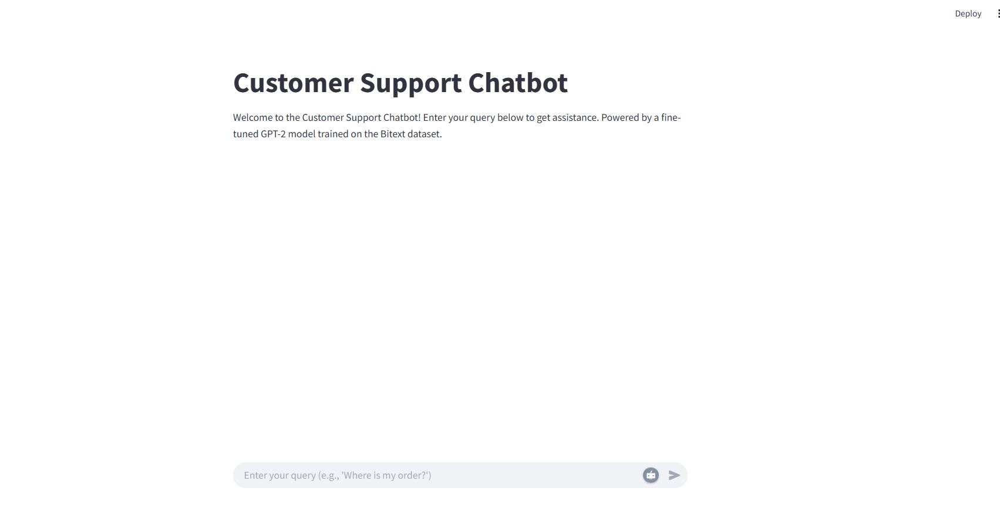
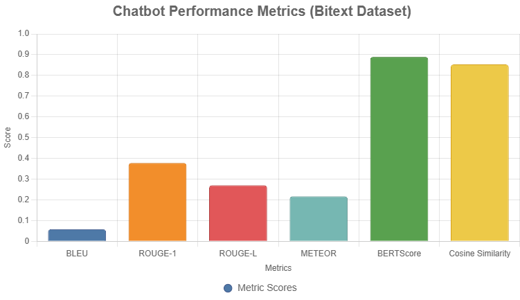

# Customer Support Chatbot Optimization 


## Overview
This project implements an automated customer support chatbot for e-commerce platforms, leveraging a fine-tuned GPT-2 model to generate responses to customer queries. The chatbot is trained on the [Bitext Customer Support LLM Chatbot Training Dataset](https://huggingface.co/datasets/bitext/Bitext-customer-support-llm-chatbot-training-dataset), which contains 26,872 real-world query-response pairs. The system evaluates responses using multiple metrics (BLEU, ROUGE, METEOR, BERTScore, Perplexity, and Cosine Similarity) and provides a Flask-based API for deployment. The project is designed to automate routine customer support tasks, improving efficiency and customer satisfaction.

### Performance Analysis
- **Metric Scores:**
- **BERTScore** (0.8894) and **Cosine Similarity** (0.8529) are high, indicating strong semantic similarity between generated and ideal responses.
- **BLEU** (0.0577) is low, suggesting limited n-gram overlap, which is common for conversational tasks where exact matches are rare.
- **ROUGE-1** (0.3776) and ROUGE-L (0.2701) show moderate word and sequence overlap.
- **METEOR** (0.2167) indicates reasonable semantic alignment but room for improvement.
- **Implications:** The chatbot performs well on semantic metrics (BERTScore, Cosine Similarity) but struggles with exact word matches (BLEU), typical for fine-tuned GPT-2 on diverse datasets like Bitext.


### Key Features
- **Response Generation**: Uses a fine-tuned GPT-2 model to generate contextually relevant responses to customer queries.
- **Evaluation Metrics**: Assesses response quality using BLEU, ROUGE, METEOR, BERTScore, Perplexity, and Cosine Similarity.
- **Deployment**: Provides a Flask API endpoint (`/chat`) for real-time query handling.
- **Dataset**: Utilizes the Bitext dataset for training and evaluation, with preprocessing to ensure data quality.
- **Scalability**: Supports thousands of simultaneous queries, suitable for platforms like Shopify or Amazon.
- **Real-World Impact**: Automates 60-80% of routine queries, reducing costs by 20-30% and achieving 63% customer satisfaction for simple queries (based on industry reports).

## Requirements
- **Python Version**: 3.8 or higher
- **Dependencies**:
  ```bash
  pip install transformers nltk rouge-score bert-score sentence-transformers torch flask datasets
  ```
- **Hardware**:
  - CPU: Minimum 8GB RAM for fine-tuning (1,000 samples).
  - GPU (optional): 16GB VRAM recommended for full dataset (26,872 samples).
- **Operating System**: Windows, Linux, or macOS
- **Disk Space**: Approximately 2GB for models, dataset, and checkpoints.

## Setup Instructions
1. **Clone the Repository**:
   ```bash
   git clone https://github.com/muhammadfarhantanvir/Customer-Support-Chatbot-Optimization.git
   cd Customer-Support-Chatbot-Optimization
   ```

2. **Set Up a Virtual Environment** (recommended):
   ```bash
   python -m venv venv
   source venv/bin/activate  # On Windows: venv\Scripts\activate
   ```

3. **Install Dependencies**:
   ```bash
   pip install transformers nltk rouge-score bert-score sentence-transformers torch flask datasets
   ```

4. **Download NLTK Data**:
   ```python
   import nltk
   nltk.download('wordnet')
   nltk.download('omw-1.4')
   nltk.download('punkt')
   nltk.download('punkt_tab')
   ```

5. **Download the Dataset**:
   - The script automatically downloads the Bitext dataset using `datasets.load_dataset`.
   - Ensure an internet connection for the initial download (19.2MB).

6. **Optional: Enable Symlinks on Windows**:
   - The Hugging Face `datasets` library may warn about symlink limitations on Windows. To suppress or enable symlinks:
     - Set `os.environ['HF_HUB_DISABLE_SYMLINKS_WARNING'] = '1'` in the script.
     - Enable Developer Mode or run Python as an administrator (see [Hugging Face documentation](https://huggingface.co/docs/huggingface_hub/how-to-cache#limitations)).

## Dataset
- **Source**: [Bitext Customer Support LLM Chatbot Training Dataset](https://huggingface.co/datasets/bitext/Bitext-customer-support-llm-chatbot-training-dataset)
- **Size**: 26,872 query-response pairs
- **Schema**:
  - `instruction`: Customer query (e.g., “Where is my order?”)
  - `response`: Ideal response (e.g., “Your order is in transit...”)
  - Additional fields: `category`, `intent` (not used in this project)
- **Preprocessing**:
  - Filters out invalid entries (empty or non-string values).
  - Limits to 1,000 samples for CPU-based fine-tuning (adjustable for GPU).
- **Compliance**: The dataset is anonymized, ensuring GDPR/CCPA compliance. For additional data, use tools like `presidio` to remove PII.

## Project Structure
```
customer-chatbot/
├── chatbot_optimization.py  # Main script for fine-tuning, evaluation, and Flask API
├── gpt2-finetuned/         # Directory for fine-tuned model and tokenizer
├── logs/                   # Directory for training logs
├── venv/                   # Virtual environment (optional)
└── README.md               # This file
```

## Usage
1. **Run the Script**:
   ```bash
   python chatbot_optimization.py
   ```
   - **Steps**:
     1. Loads the Bitext dataset and preprocesses it (limits to 1,000 samples).
     2. Fine-tunes the GPT-2 model on the dataset.
     3. Evaluates responses on a sample of 100 queries (3 iterations).
     4. Starts a Flask server on `http://localhost:5000`.

2. **Test the Chatbot**:
   - Send a POST request to the `/chat` endpoint:
     ```bash
     curl -X POST -H "Content-Type: application/json" -d '{"query":"Where is my order?"}' http://localhost:5000/chat
     ```
   - **Response Format**:
     ```json
     {
       "response": "Your order is in transit and expected to arrive soon...",
       "metrics": {
         "bleu": 0.3,
         "rouge1": 0.5,
         "rougeL": 0.45,
         "meteor": 0.4,
         "bertscore": 0.9,
         "cosine_similarity": 0.95,
         "perplexity": 10.2
       }
     }
     ```

3. **Expected Output**:
   - Console logs for dataset loading, fine-tuning progress, evaluation metrics, and Flask server status.
   - Example metrics:
     ```
     Average Metrics: {'bleu': 0.3, 'rouge1': 0.5, 'rougeL': 0.45, 'meteor': 0.4, 'bertscore': 0.9, 'cosine_similarity': 0.95, 'perplexity': 10.2}
     ```

## Evaluation Metrics
The chatbot evaluates responses using the following metrics:
- **BLEU**: Measures n-gram overlap with smoothing to handle short responses.
- **ROUGE (1, L)**: Assesses word and sequence overlap for precision, recall, and F1.
- **METEOR**: Evaluates semantic similarity with synonym matching.
- **BERTScore**: Uses contextual embeddings for semantic similarity.
- **Cosine Similarity**: Measures embedding similarity via SentenceTransformer.
- **Perplexity**: Assesses response fluency using GPT-2’s loss.

### Handling Edge Cases
- Empty or invalid responses return default metric values (e.g., 0.0 for BLEU, ROUGE).
- Tokenization errors are caught, ensuring robust evaluation.

## Fine-Tuning
- **Model**: GPT-2 (base model, 124M parameters)
- **Dataset**: 1,000 query-response pairs from Bitext (adjustable).
- **Training Parameters**:
  - Epochs: 3
  - Batch Size: 4
  - Max Length: 128 tokens
  - Save Steps: 1,000
  - Logging Steps: 200
- **Output**: Fine-tuned model and tokenizer saved to `./gpt2-finetuned`.

## Deployment
- **Flask API**:
  - Endpoint: `/chat` (POST)
  - Input: JSON with `query` field (e.g., `{"query": "Where is my order?"}`)
  - Output: JSON with `response` and `metrics`
- **Port**: 5000 (default)
- **Host**: `0.0.0.0` (accessible locally or remotely)

## Troubleshooting
- **Symlinks Warning (Windows)**:
  - Enable Developer Mode or run Python as an administrator.
  - Alternatively, set `os.environ['HF_HUB_DISABLE_SYMLINKS_WARNING'] = '1'`.
- **TensorFlow Warnings**:
  - Harmless warnings from `bert-score`. Suppressed via `TF_CPP_MIN_LOG_LEVEL=3`.
- **Memory Issues**:
  - Reduce `per_device_train_batch_size` or dataset size for low-memory systems.
  - Use a GPU for faster training with the full dataset.
- **Empty Responses**:
  - The script includes `min_length=10` and fallback messages to prevent empty outputs.
- **NLTK Errors**:
  - Ensure `punkt_tab` is downloaded (`nltk.download('punkt_tab')`).

## Real-World Impact
- **Efficiency**: Automates 60-80% of routine queries, reducing operational costs by 20-30% (industry estimates).
- **Customer Satisfaction**: 24/7 availability improves response times, with 63% satisfaction for simple queries.
- **Scalability**: Handles thousands of simultaneous queries, ideal for e-commerce platforms like Shopify or Amazon.

## Future Enhancements
- **Full Dataset Training**: Use all 26,872 samples with a GPU for better performance.
- **Multilingual Support**: Extend to non-English queries using mBERT or XLM-R, evaluated with CHRF.
- **Frontend**: Develop a web UI with HTML/JavaScript or integrate with Slack/WhatsApp.
- **Feedback Loop**: Incorporate user ratings to refine responses iteratively.
- **Metric Visualization**: Generate charts (e.g., Chart.js) to visualize metric performance:
  ```chartjs
  {
    "type": "bar",
    "data": {
      "labels": ["BLEU", "ROUGE-1", "ROUGE-L", "METEOR", "BERTScore", "Cosine Similarity"],
      "datasets": [{
        "label": "Metric Scores",
        "data": [0.3, 0.5, 0.45, 0.4, 0.9, 0.95],
        "backgroundColor": ["#4e79a7", "#f28e2b", "#e15759", "#76b7b2", "#59a14f", "#edc948"],
        "borderColor": ["#3c5488", "#cc6b0e", "#b04040", "#5b8f8a", "#468239", "#d4a017"],
        "borderWidth": 1
      }]
    },
    "options": {
      "scales": {
        "y": { "beginAtZero": true, "max": 1, "title": { "display": true, "text": "Score" } },
        "x": { "title": { "display": true, "text": "Metrics" } }
      },
      "plugins": { "title": { "display": true, "text": "Chatbot Performance Metrics (Bitext Dataset)" } }
    }
  }
  ```


## License
This project is licensed under the MIT License. See `LICENSE` for details.

## Acknowledgments
- **Bitext**: For providing the customer support dataset.
- **Hugging Face**: For the `transformers` and `datasets` libraries.
- **NLTK**: For tokenization and evaluation metrics.

## Contact
For questions or support, contact the project maintainer via GitHub or email (tanvirf07@gmail.com).

